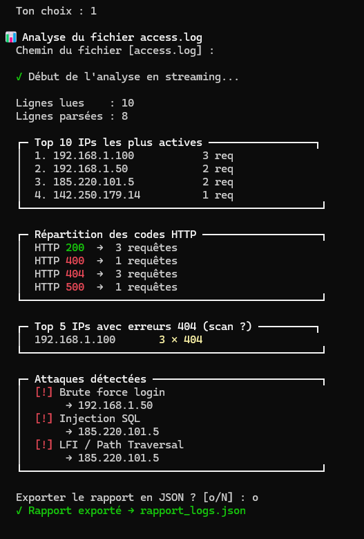
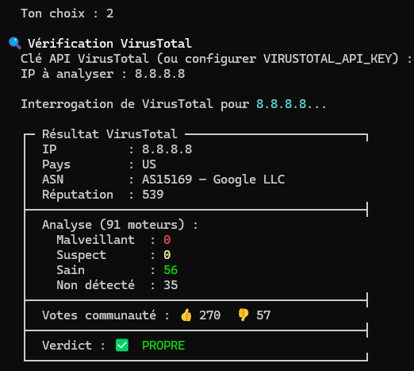
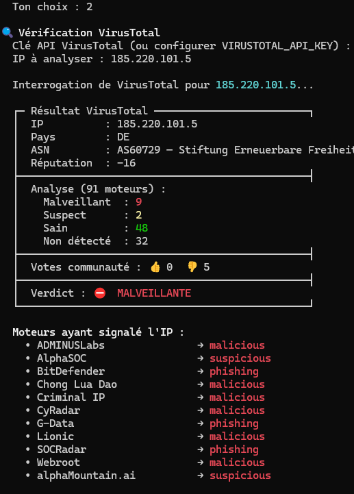
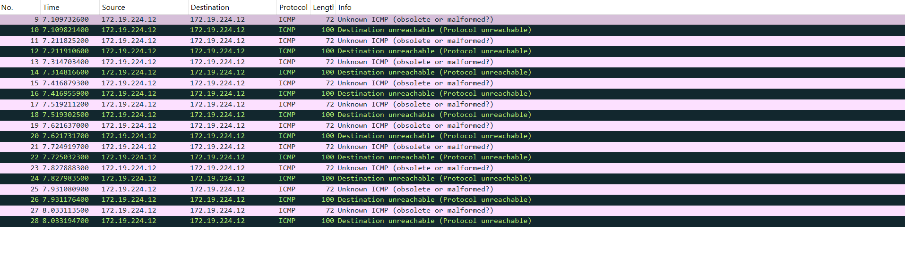
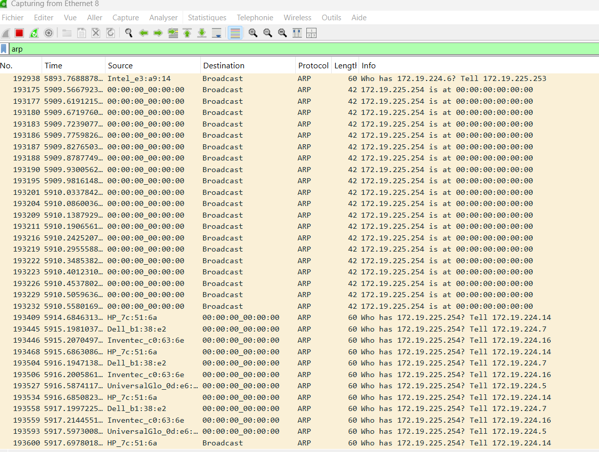

# 🛡️ SIEM & Network Security Toolkit

Un outil d'analyse de sécurité, de threat intelligence et de simulation d'attaques réseau développé en Python. Ce projet combine l'analyse automatisée de logs de serveurs Web, l'enrichissement de données de menace via l'API VirusTotal, et l'injection de paquets réseau protocolaires via Scapy (ARP & ICMP).

## 🎯 Contexte

Ce toolkit a été développé dans le cadre d'un stage en cybersécurité à l'**Entente Valabre**, au sein de la **Division Innovation et Prospective**.

L'objectif était de construire un outil modulaire permettant de couvrir les trois piliers d'une analyse SOC : la détection par analyse de logs, l'enrichissement par Threat Intelligence, et la validation des règles de détection par simulation d'attaques réseau (Wazuh, Arpwatch).

---

## 🚀 Fonctionnalités

### 📊 Module 1 — Analyseur de Logs (Log Parser)
- Lecture en **streaming ligne par ligne** — empreinte mémoire constante, adapté aux fichiers volumineux (10+ Go)
- Extraction des métriques clés : Top 10 IPs, répartition des codes HTTP, détection des scans (erreurs 404)
- Détection d'attaques par **signatures regex** couvrant le Top 10 OWASP : Injections SQL, XSS, Path Traversal, Brute Force, Webshells
- Export automatique des rapports au format **JSON** (`rapport_logs.json`)

### 🔍 Module 2 — Threat Intelligence (VirusTotal)
- Interrogation en temps réel de l'**API v3 VirusTotal** pour évaluer la réputation d'une IP suspecte
- Affichage du verdict de dangerosité, pays d'origine, ASN et détail des moteurs de sécurité ayant signalé l'IP
- Support de la clé API via **variable d'environnement** pour une utilisation pro sans saisie manuelle

### 🛠️ Module 3 — Simulateur de Trafic Réseau (Scapy)
- **ICMP Malformé :** Forge et injecte des paquets ICMP non standards (Type 99, invalide selon RFC 792) pour tester la réactivité des IDS et règles Wazuh
- **Flood ARP :** Génération de fausses réponses ARP (`is-at`) pour simuler un empoisonnement de cache et valider le déclenchement d'alertes Arpwatch (Rule 7209)

---

## 📦 Prérequis & Installation

### 1. Cloner le dépôt
```bash
git clone https://github.com/VOTRE_PSEUDO/siem-toolkit.git
cd siem-toolkit
```

### 2. Installer les dépendances
```bash
pip install scapy
```

> **Windows uniquement :** Installez [Npcap](https://npcap.com) avant de lancer le script. Sans ce driver, Scapy ne peut pas forger de paquets.

### 3. Configurer la clé API VirusTotal (recommandé)

Créez un compte gratuit sur [VirusTotal Community](https://www.virustotal.com/) et définissez votre clé comme variable d'environnement pour éviter de la saisir à chaque lancement :

```bash
# Linux / macOS
export VIRUSTOTAL_API_KEY="votre_cle_api_ici"

# Windows (PowerShell)
$env:VIRUSTOTAL_API_KEY="votre_cle_api_ici"
```

Si la variable n'est pas définie, le script vous demandera la clé manuellement.

---

## 💻 Utilisation

> ⚠️ **Privilèges requis :** Le Module 3 (Scapy) nécessite un accès aux raw sockets. Lancez le script en **Administrateur** sur Windows ou avec **sudo** sur Linux.

```bash
# Linux / macOS
sudo python3 siem_toolkit.py

# Windows (terminal Administrateur)
python siem_toolkit.py
```

---

## 🧪 Cadre de validation & Preuves de Concept

Ce toolkit a été conçu pour boucler la boucle de détection en environnement de laboratoire :

1. **Simulation** — Injection d'une anomalie réseau via le Module 3 (ICMP malformé ou ARP poisoning)
2. **Collecte** — Capture du trafic généré avec Wireshark (`icmp or arp`)
3. **Détection** — Validation que les règles de corrélation remontent correctement dans Wazuh (ex: Rule 7209 pour changement de MAC ARP)

---

### 📊 Module 1 — Analyse de logs & Détection d'attaques

Détection automatique d'attaques par signatures sur un fichier `access.log` d'exemple, avec export JSON du rapport.

<p align="center">
  
</p>

---

### 🔍 Module 2 — Threat Intelligence VirusTotal

Vérification de la réputation d'une IP suspecte extraite des logs. Ici, `185.220.101.5` identifiée comme **malveillante** par 9 moteurs, et `8.8.8.8` (Google DNS) confirmée **propre**.

<table align="center" border="0" cellpadding="10">
  <tr>
    <td align="center" valign="top">
      
      <br><br>
      <sub>🍏 <b>Analyse d'une IP saine (Google DNS)</b></sub>
    </td>
    <td align="center" valign="top">
      
      <br><br>
      <sub>🍎 <b>Détection d'une IP malveillante (Nœud Tor)</b></sub>
    </td>
  </tr>
</table>

---

### 🛠️ Module 3 — Simulation d'attaques réseau (Wireshark)

**ICMP Malformé :** Les paquets injectés avec le Type 99 (invalide selon RFC 792) sont immédiatement identifiés par Wireshark comme `Unknown ICMP (obsolete or malformed?)`. La pile réseau répond avec `Destination unreachable (Protocol unreachable)`, confirmant la détection de l'anomalie protocolaire.

<p align="center">
  
</p>

**ARP Flooding :** Le flood de fausses réponses ARP (`172.19.225.254 is at 00:00:00:00:00:00`) empoisonne le cache des machines du réseau. On observe la réaction en panique des hôtes (HP, Dell, Inventec) qui tentent en boucle de retrouver la vraie adresse MAC de la passerelle.

<p align="center">
  
</p>

---

## 📁 Structure du dépôt

```text
├── siem_toolkit.py       # Script principal unifié (Modules 1, 2, 3)
├── requirements.txt      # Liste des dépendances Python
├── README.md             # Documentation du projet
├── access.log            # Exemples de logs pour tester le Module 1
├── .gitignore
└── images/               # Capture d'écran pour le README.md
```


---

## ⚠️ Disclaimer

Cet outil est développé uniquement à des fins pédagogiques, académiques et de recherche en sécurité informatique dans un environnement de laboratoire isolé (machines virtuelles, réseau host-only). L'utilisation de cet outil pour cibler des infrastructures sans l'accord explicite et écrit de leur propriétaire est strictement interdite et passible de sanctions pénales. L'auteur décline toute responsabilité quant à un usage malveillant ou hors d'un cadre autorisé.
